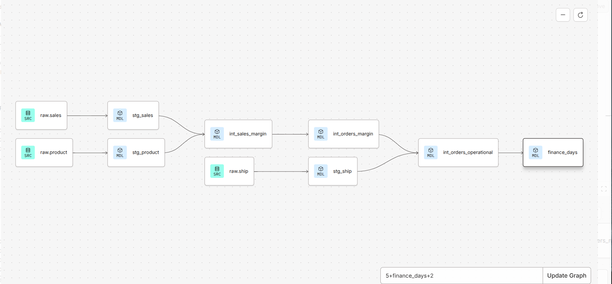

# Greenweez Analytics Pipeline — dbt + BigQuery

A layered analytics pipeline built with **dbt** on **Google BigQuery**, transforming raw e-commerce
transaction data into a documented, tested daily metrics table for a finance team.

This was my first hands-on project with dbt and BigQuery. I built it as part of a data analytics
course, but I've written this README to document not only *what* the pipeline does, but *why* each
decision was made and what I learned while debugging it.

---

## The Business Problem

Greenweez (an e-commerce company) has a finance team that wants to run **basket analysis**. They
asked for a single daily-grain table containing:

- Number of transactions per day
- Average basket value per day
- Margin and operational margin per day

They also set four requirements for *how* the pipeline should be built:

| Requirement | How this pipeline addresses it |
|---|---|
| **Data accuracy & protection** | Primary-key tests (`unique`, `not_null`) block bad data before it propagates downstream |
| **Error identification & management** | Layered models isolate failures — a broken transformation surfaces in one model, not across the whole pipeline |
| **Organized & accessible structure** | Models are materialised into a dedicated dataset, separate from raw data |
| **Comprehensive documentation** | Every source, table and column has a description in `schema.yml`; lineage is auto-generated from `ref()` / `source()` calls |

---

## Stack

- **dbt** (dbt Cloud / Studio IDE, Fusion engine)
- **Google BigQuery** — data warehouse
- **Git / GitHub** — version control
- **YAML** — source definitions, documentation, tests

---

## Architecture



The pipeline follows a **bronze → silver → gold** (medallion) layering pattern:

```
raw.sales   ──→ stg_sales   ─┐
                             ├─→ int_sales_margin ──→ int_orders_margin ─┐
raw.product ──→ stg_product ─┘                                           │
                                                                         ├─→ int_orders_operational ──→ finance_days
raw.ship    ──→ stg_ship ────────────────────────────────────────────────┘
```

**7 models · 5 data tests · 3 sources**

### Why layers?

Writing the finance team's table as one giant query would technically work. It would also be
unreadable, untestable, and impossible to debug. Splitting the logic means:

- Each model has **one job**
- A failure points to a specific step, not to a 200-line query
- Intermediate results can be inspected and validated independently
- Business logic lives in one place instead of being copy-pasted across dashboards

---

## Layer by layer

### Bronze — Sources (`models/schema.yml`)

Raw BigQuery tables are declared as dbt sources with aliases, so models reference
`{{ source('raw', 'sales') }}` instead of the full `project.dataset.raw_gz_sales` path.

```yaml
sources:
  - name: raw
    database: greenweez-507113
    schema: gz_raw_data
    tables:
      - name: sales
        identifier: raw_gz_sales
```

**Why alias?** If a table gets renamed upstream, I change one line in the YAML instead of hunting
through every model that references it.

### Silver — Staging (`models/staging/`)

Staging models do **cleanup only** — no business logic, no joins, no aggregation.

| Model | What it fixes |
|---|---|
| `stg_sales` | Renames `pdt_id` → `products_id` for consistent join keys |
| `stg_product` | Renames the source typo `purchSE_PRICE` → `purchase_price`, casts `STRING` → `FLOAT64` |
| `stg_ship` | Renames `logCost` → `log_cost`, casts `ship_cost` from `STRING` → `FLOAT64`, drops the duplicate `shipping_fee_1` column |

This is where the real-world messiness gets absorbed. The source data had a **misspelled column
name**, a **numeric value stored as text**, and a **duplicated column** — all of which I fixed once
here rather than working around them in every downstream model.

### Silver — Intermediate (`models/intermediate/`)

| Model | Grain | What it computes |
|---|---|---|
| `int_sales_margin` | one row per product per order | `purchase_cost = quantity × purchase_price`, `margin = revenue − purchase_cost` |
| `int_orders_margin` | one row per order | Aggregates the above to order level with `GROUP BY orders_id, date_date` |
| `int_orders_operational` | one row per order | Joins shipping data: `operational_margin = margin + shipping_fee − log_cost − ship_cost` |

### Gold — Mart (`models/mart/finance_days.sql`)

The finance team's deliverable. One row per day, containing every metric they asked for.

```sql
with orders_per_day as (
    select
        date_date,
        count(distinct orders_id) as nb_transactions,
        round(sum(revenue), 0) as revenue,
        ...
    from {{ ref('int_orders_operational') }}
    group by date_date
)

select
    date_date,
    nb_transactions,
    revenue,
    ...
    round(revenue / nullif(nb_transactions, 0), 2) as average_basket
from orders_per_day
order by date_date desc
```

---

## Data quality

### Profiling the source data

Beyond the required tests, I ran a few quality checks of my own. One product in the catalogue
(1 of 16,740) has a purchase price of `0`, which would inflate margin for any sale of that item.
Measuring the actual impact showed it affects 2 sales rows and overstates total margin by ~9 —
negligible at this volume.

The number is small, but the failure mode isn't: a zero purchase price produces a margin equal to
full revenue, silently and without error. It's worth encoding as a test rather than relying on the
volume staying low.

### Tests

```yaml
- name: product
  columns:
    - name: products_id
      tests: [unique, not_null]

- name: sales
  tests:
    - unique:
        column_name: "concat(cast(orders_id as string), '-', cast(pdt_id as string))"
```

`sales` has a **composite primary key** — one order contains multiple products, so `orders_id`
alone isn't unique. Uniqueness only holds for the `orders_id + pdt_id` combination.

These tests turn assumptions into checks. Before writing them, "orders_id is unique in the ship
table" was something I believed. Now it's something the pipeline verifies on every run.

### Freshness

```yaml
config:
  loaded_at_field: "CAST(date_date AS TIMESTAMP)"
  freshness:
    warn_after: {count: 90, period: day}
```

Run with `dbt source freshness`. This dataset is static (2021 data), so the warning fires by
design — the point was to understand the mechanism. In production, freshness checks catch the
failure mode where an ETL job silently stops and dashboards keep showing stale numbers without
anything appearing broken.

---

## Decisions worth explaining

**`LEFT JOIN` everywhere, never `INNER JOIN`.**
`sales` and `int_orders_margin` are the fact tables — every row is a real transaction. An
`INNER JOIN` would silently drop orders with no matching product or shipping record, and the
daily transaction count would be quietly wrong. `LEFT JOIN` keeps the row and returns `NULL`
for the missing piece. Missing data should be *visible*, not deleted.

**Casting in staging, not in the calculation.**
`ship_cost` arrives as `STRING`. Casting it once in `stg_ship` means every downstream model gets
a clean number. Casting it inline in three different models would be three places to break.

**`FLOAT64`, not `INT64`.**
Prices have decimals. `CAST(2.99 AS INT64)` returns `2` — no error, no warning, just a wrong
margin. This is the most dangerous class of bug: it doesn't crash, it just lies.

**`NULLIF(nb_transactions, 0)`.**
Division-by-zero protection. A day with no transactions returns `NULL` instead of killing the query.

**No `SELECT *` in models.**
Explicit column lists prevent duplicate-column collisions after joins, stop models from silently
growing when upstream tables gain columns, and document what's actually being used.

---

## What I learned

I expected the hard part to be SQL. It wasn't — the SQL was the fastest part. The real learning
came from everything around it.

**Reading errors as a diagnostic, not a wall.**
Working through this, the same query failed four different ways, and each error pointed at a
different layer:

| Error | Layer | Fix |
|---|---|---|
| `404 Not Found: Dataset not found` | Wrong GCP project | Added `database:` to the source definition |
| `403 Access Denied` | IAM permissions | Granted the service account BigQuery Data Viewer + Job User |
| `Storage API is not available` | Disabled GCP service | Enabled the BigQuery Storage Read API |
| `No matching signature for operator *: INT64, STRING` | Data type mismatch | `CAST(... AS FLOAT64)` in staging |

Learning to tell *which* of these I was looking at — before changing any code — was probably the
single most useful skill I picked up. 404 means the address is wrong. 403 means the address is
right and the identity is wrong. They look similar and have nothing to do with each other.

**Source data is never clean.**
`purchSE_PRICE` is a typo in the raw table. `shipping_fee` and `shipping_fee_1` are duplicates.
`ship_cost` is a number stored as text. None of this appears in tutorials, and none of it can be
fixed at the source. The staging layer exists precisely to absorb this.

**Documentation as code, not as an afterthought.**
Writing descriptions in `schema.yml` felt tedious until I saw the lineage graph — a diagram nobody
drew, generated entirely from `ref()` and `source()` calls. When the finance team asks "where does
this margin number come from?", the answer is a link, not a meeting.

**`dbt run` vs `dbt build`.**
`run` creates models. `build` runs tests *and* creates models. Using `run` while believing I was
testing anything was a false sense of safety.

**Verify the given solution against the requirements.**
The course-provided solution computed `nb_transactions` in a CTE and then forgot to include it in
the final `SELECT` — even though "total number of transactions" was explicitly on the finance
team's list. Comparing output against the actual requirement, rather than trusting reference code,
caught it.

---

## Repository structure

```
models/
├── schema.yml                        # source definitions, descriptions, tests, freshness
├── staging/
│   ├── stg_sales.sql
│   ├── stg_product.sql
│   └── stg_ship.sql
├── intermediate/
│   ├── int_sales_margin.sql
│   ├── int_orders_margin.sql
│   └── int_orders_operational.sql
└── mart/
    └── finance_days.sql
```

---

## Running it

```bash
dbt build                 # run all models + tests
dbt build --select mart   # rebuild just the gold layer
dbt source freshness      # check source staleness (separate from build)
dbt docs generate         # generate documentation site
```

Lineage can be inspected in the dbt Studio IDE. To see the full graph rather than the default
two-hop view, set the selector to `+finance_days+`.

---

## What I'd add next

- Tests on the intermediate and mart models, not just the sources — e.g. `not_null` on
  `operational_margin` to quantify how many orders lack shipping records
- A test flagging `purchase_price = 0` in `stg_product` — currently affects 1 product with
  negligible impact, but the failure mode is silent and would scale
- Incremental materialisation for `finance_days` — full refresh is fine at this volume, but
  wouldn't be at scale
- A deployment environment with a scheduled job, so documentation and freshness checks run
  automatically rather than on demand

---

*Built as part of a data analytics course. All source data is course-provided sample data.*
